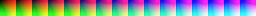
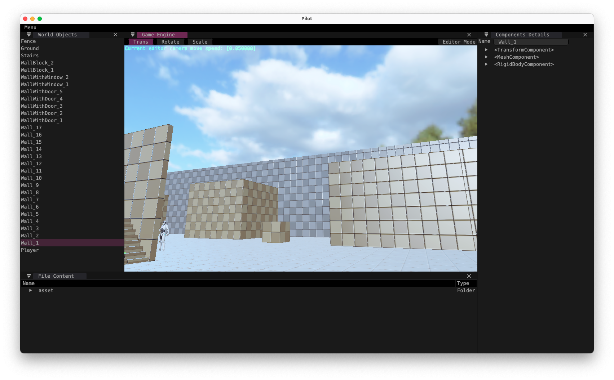

## Homework02 报告

### 基础项·一

```glsl
#version 310 es
#extension GL_GOOGLE_include_directive : enable
#include "constants.h"

layout(input_attachment_index = 0, set = 0, binding = 0) uniform highp subpassInput in_color;
layout(set = 0, binding = 1) uniform sampler2D color_grading_lut_texture_sampler;
layout(location = 0) out highp vec4 out_color;

void main()
{
    // 抓取像素颜色
    highp vec4 color       = subpassLoad(in_color).rgba;
    // 获取lut图尺寸并提取量化深度
    highp ivec2 lut_tex_size = textureSize(color_grading_lut_texture_sampler, 0);
    highp float _COLORS      = float(lut_tex_size.y);
    // 通过蓝色通道计算需要采样lut图中的哪两个区块
    highp float blue_scale;
    blue_scale=color.b*_COLORS;
    highp vec2 blue_quant;
    blue_quant.x=floor(blue_scale);
    blue_quant.y=ceil(blue_scale);
    // 计算两个需要采样的uv坐标
    highp vec2 pos_floor;
    pos_floor.x=(color.r+blue_quant.x)/_COLORS;
    pos_floor.y=color.g;
    highp vec2 pos_ceil;
    pos_ceil.x=(color.r+blue_quant.y)/_COLORS;
    pos_ceil.y=color.g;
    // 两次lut采样
    lowp vec4 color_floor=texture(color_grading_lut_texture_sampler,pos_floor);
    lowp vec4 color_ceil=texture(color_grading_lut_texture_sampler,pos_ceil);
    // 三次线性插值
    color=color_floor+(color_ceil-color_floor)*fract(blue_scale);
    
    out_color = color;
}
```

首先片段着色器获取得到lut图的尺寸信息，抓取像素颜色后根据蓝色通道计算需要采样lut图中的哪两个区块单元用于插值。而后分别以“向下取整”和“向上取整”策略计算lut图中的对应需要采样的坐标，进行两次采样并根据蓝通道量化后的小数部分当作权重进行线性插值得到最终映射的颜色。

### 基础项·二

使用Affinity Photo对Pilot原始画面截帧进行了调色，导出为cube格式的lut后，对一张16\*16\*16的Neutral Lut进行套lut映射保存得到自定义lut图。



引擎改用这张图后得到的效果如下（属于是提亮冷色高饱和战士）。



### 提高项

没有vulkan基础寸步难行，寄了😮‍💨。
