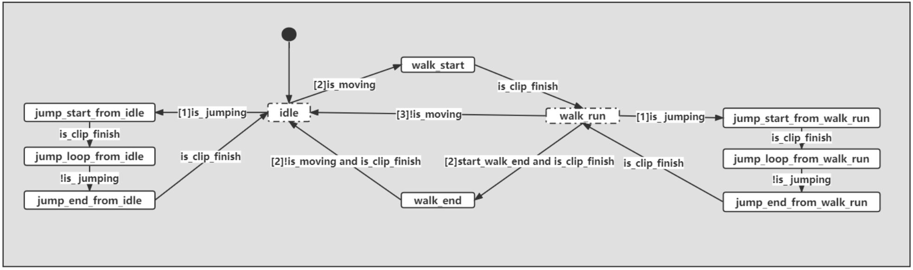

## Homework03 报告

### AFSM

```c++
    bool AnimationFSM::update(const json11::Json::object& signals)
    {
        States last_state     = m_state;
        bool   is_clip_finish = tryGetBool(signals, "clip_finish", false);
        bool   is_jumping     = tryGetBool(signals, "jumping", false);
        float  speed          = tryGetFloat(signals, "speed", 0);
        bool   is_moving      = speed > 0.01f;

        switch (m_state)
        {
            case States::_idle:
                if (is_jumping) {
                    m_state=States::_jump_start_from_idle;
                }
                else if (is_moving) {
                    m_state=States::_walk_run;
                }
                break;
            case States::_walk_run:
                if (is_jumping) {
                    m_state=States::_jump_start_from_walk_run;
                }
                else if (!is_moving) {
                    m_state=States::_idle;
                }
                break;
            case States::_jump_start_from_idle:
                if (is_clip_finish) {
                    m_state=States::_jump_loop_from_idle;
                }
                break;
            case States::_jump_loop_from_idle:
                if (!is_jumping) {
                    m_state=States::_jump_end_from_idle;
                }
                break;
            case States::_jump_end_from_idle:
                if (is_clip_finish) {
                    m_state=States::_idle;
                }
                break;
            case States::_jump_start_from_walk_run:
                if (is_clip_finish) {
                    m_state=States::_jump_loop_from_walk_run;
                }
                break;
            case States::_jump_loop_from_walk_run:
                if (!is_jumping) {
                    m_state=States::_jump_end_from_walk_run;
                }
                break;
            case States::_jump_end_from_walk_run:
                if (is_clip_finish) {
                    m_state=States::_walk_run;
                }
                break;
            default:
                break;
        }
       
        return last_state != m_state;
    }
```

按照作业要求的状态转移图填写了switch部分代码，在各个状态下依照优先级顺序依次根据`is_moving `、 `is_jumping`等标识符的状态变化将`m_state`切换至下一状态。



目前对状态转移图仍存在一些困惑，比如`start_walk_end`的作用没有搞清楚，并且认为角色在动起来之后除开跳跃情况已经进入了idle_walk_run三者的BlendState，貌似没有机会也没有必要进入walk_start和walk_end状态，于是尝试精简掉了该部分代码，经过测试删减后的动作表现也能够正常满足所有状态机逻辑。

### Blend

```c++
void AnimationPose::blend(const AnimationPose& pose)
{
    for (int i = 0; i < m_bone_poses.size(); i++)
    {
        auto&       bone_trans_one = m_bone_poses[i];
        const auto& bone_trans_two = pose.m_bone_poses[i];

        float sum_weight = m_weight.m_blend_weight[i]+pose.m_weight.m_blend_weight[i];
        if (sum_weight != 0)
        {
            float cur_weight = pose.m_weight.m_blend_weight[i]/sum_weight;
            m_weight.m_blend_weight[i] = sum_weight;
            bone_trans_one.m_position  = Vector3::lerp(bone_trans_one.m_position, 		    																					 bone_trans_two.m_position, cur_weight);
            bone_trans_one.m_scale     = Vector3::lerp(bone_trans_one.m_scale, 																											 bone_trans_two.m_scale, cur_weight);
            bone_trans_one.m_rotation  = Quaternion::sLerp(cur_weight, 																															 bone_trans_one.m_rotation, 																																 bone_trans_two.m_rotation, true);
        }
    }
}
```

这里的`AnimationComponent::blend()`函数通过两次插值得到idle_walk_run三者的混合结果。这里借用论坛大佬对我提出问题的回答解释：

> 这里的混合逻辑可以理解为先拿B跟A混合，存到A里；再拿C跟A混合，存到A里，最终得到三者的混合结果。假设A、B、C三者pose的权重分别是0.5、0.3、0.2，第一次混合时B的归一化权重是：0.3/(0.3+0.5)（也就是`cur_weight`），A的归一化权重就是5/8。另外记录`sum_weight`为0.8，用于当作下次混合是A的权重（此时的A存储的已经是AB的混合结果）。然后第二次混合时C的归一化权重是0.2/(0.2+0.8)，A占0.8。最终得到的结果跟我们平时计算0.5*A+0.3*B+0.2*C是一样的。

非常感谢这位大佬，要不然真的不好懂这一块的逻辑。

另外其中的位置与缩放插值可以直接使用线性插值，而旋转维度需要使用SLerp插值并且将shortest_path标识设置为true，以避免插值的多值性导致动画鬼畜。

### Controller

```c++
Vector3 CharacterController::move(const Vector3& current_position, const Vector3& displacement)
    {
        std::shared_ptr<PhysicsScene> physics_scene =
            g_runtime_global_context.m_world_manager->getCurrentActivePhysicsScene().lock();
        ASSERT(physics_scene);

        std::vector<PhysicsHitInfo> hits;

        Transform world_transform = Transform(
            current_position,
            Quaternion::IDENTITY,
            Vector3::UNIT_SCALE);

        Vector3 vertical_displacement   = displacement.z * Vector3::UNIT_Z;
        Vector3 horizontal_displacement = Vector3(displacement.x, displacement.y, 0.f);

        Vector3 vertical_direction   = vertical_displacement.normalisedCopy();
        Vector3 horizontal_direction = horizontal_displacement.normalisedCopy();

        Vector3 final_position = current_position;

        m_is_touch_ground = physics_scene->raycast(
            world_transform.m_position,
            Vector3::NEGATIVE_UNIT_Z,
            0.01f,
            hits);

        hits.clear();

        // vertical pass
        if (physics_scene->sweep(
            m_rigidbody_shape,
            world_transform.getMatrix(),
            vertical_direction,
            vertical_displacement.length(),
            hits)
            &&
            m_is_touch_ground)
        {
            final_position += hits[0].hit_distance * vertical_direction;
        }
        else
        {
            final_position += vertical_displacement;
        }

        hits.clear();

        // side pass
        world_transform.m_position += 0.1f * Vector3::UNIT_Z;
        if (physics_scene->sweep(
            m_rigidbody_shape,
            world_transform.getMatrix(),
            horizontal_direction,
            horizontal_displacement.length(),
            hits))
        {
            world_transform.m_position += 0.2f * Vector3::UNIT_Z;
            if (!physics_scene->sweep(
              m_rigidbody_shape,
              world_transform.getMatrix(),
              horizontal_direction,
              horizontal_displacement.length(),
              hits))
            {
                final_position += Vector3(0.f, 0.f, 0.2f) + horizontal_displacement;
            }
            else
            {
                float sliding_displacement = hits[0].hit_normal.x * 																																		 horizontal_displacement.y - 																																 hits[0].hit_normal.y * 																																		 horizontal_displacement.x;
                Vector3 sliding_direction = Vector3(-hits[0].hit_normal.y, 																															hits[0].hit_normal.x, hits[0].hit_normal.z);
                final_position += sliding_direction * sliding_displacement;
            }
        }
        else
        {
            final_position += horizontal_displacement;
        }

        return final_position;
    }
```

首先解释横向碰撞的实现，这里在side_pass中每帧调用`sweep`形状扫描接口从角色RigidBody位置出发向水平运动方向进行距离为对应displacement的扫描检测是否会遇到碰撞体。

当检测结果为假时表明没有碰撞会发生，即可将对应displacement对`final_position`进行累加表现为角色继续横向运动。

而当检测结果为真时，为了实现Auto-Stepping效果，这里使用了课上老师所提的方法将角色碰撞体提高一定的高度进行二次横向碰撞检测，若不发生碰撞则将角色抬高后继续移动，若仍有碰撞发生那就只好就地待命处理碰撞。在处理碰撞的分支中，为了实现sliding效果，可以使用简单的数学运算对当前运动矢量以及碰撞体的法向矢量进行处理计算得到sliding的方向与displacement，后累加于`final_position`中实现~~华强~~滑墙效果。

然后是垂直方向的碰撞处理，原始代码在碰到墙壁的下落阶段会发生卡墙的情况，是因为使用`sweep`接口检测碰撞到墙壁而停止运动导致的。解决方法很简单，理论上只要把形状扫描时用的RigidBody缩小一圈去检测就可以了，因为横向碰撞检测中大一圈的RigidBody已经能够挡住角色运动，那小一圈的RigidBody肯定不会检测到墙壁了，这里换用更简单的raycast射线检测从角色中心向下检测地面，在原始代码判断条件中加入`m_is_touch_ground`状态的判断，如果没有接触到地面就继续运动，只有接触到地面才停止下落。
